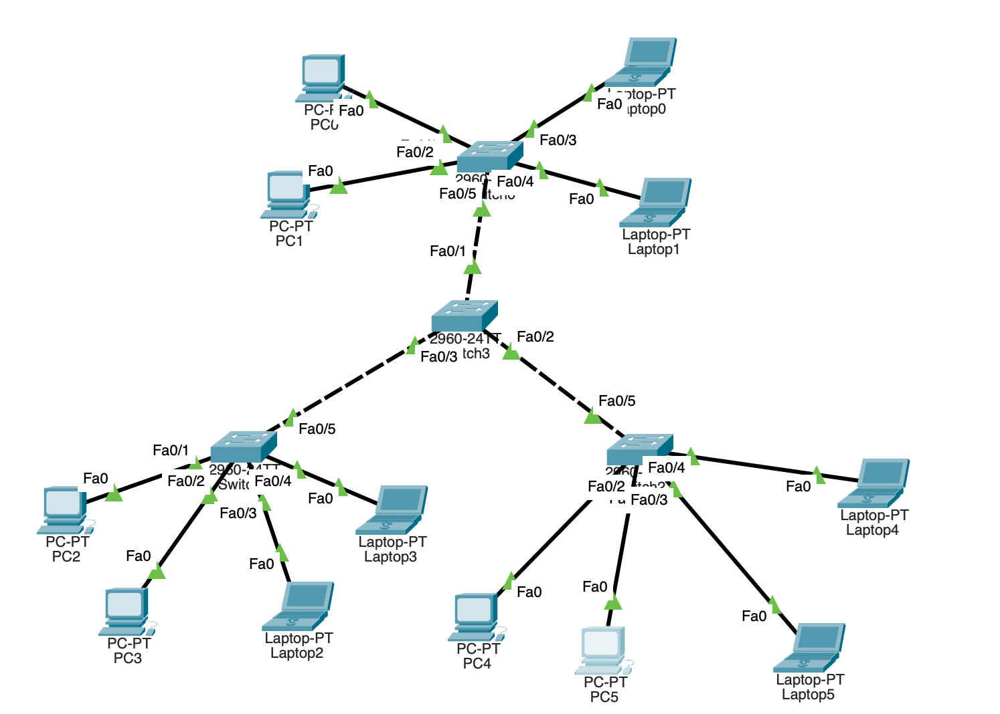

# 패킷트레이서란?

- CISCO에서 무료로 제공하는 교육용 네트워크 시뮬레이터

# 사용법

1. 장치 타입 → End Devices 선택
2. PC 아이콘을 작업 공간에 드래그 & 드롭
3. Laptop 아이콘을 작업공간에 드래그 & 드롭
4. PC와 Laptop을 각각 1개씩 더 추가
5. 각 디바이스를 연결할 스위치도 추가 (총 4개)
6. 장치 타입 → Connections(번개모양) 선택
7. Copper Straight-Through(실선) 선택
8. 스위치0 클릭 → 메뉴에서 `FastEthernet0/1` 선택
9. PC0 클릭 → 메뉴에서 `FastEthernet0` 선택
10. 나머지도 동일하게 연결
11. Copper Cross-Over(점선) 선택하여 인접 스위치끼리 연결
12. 왼쪽 스위치는 `FastEthernet0/2` 오른쪽 스위치는 `FastEthernet0/3`
13. PC 클릭 → Desktop → IP Configuration → IP Address에 `198.168.0.1` , Subnet Mask에 `255.255.255.0` 
14. 나머지 디바이스는 IP 주소 ~0.2, ~0.3 순으로 입력
15. Desktop → Command Prompt로 ping 테스트
16. 작업 공간에서 Simulation 가능

# 토폴로지

- 랜 연결 방식

## Bus 형

Ping 테스트(PC0 → PC1)

## 링형

Ping 테스트(PC0 → PC1)

## 스타형

Ping 테스트(PC0 → PC1)

- 다른 토폴로지와 달리, 1번째는 실패하고 2번째에 성공한 모습

## 매쉬(그물)형

Ping 테스트(PC0 → PC1)

## 트리형

Ping 테스트(PC0 → PC1)

# 스타형에서만 Ping 동작이 한번에 안된 이유

- 네트워크에서 이더넷 스위치는 MAC 주소를 학습하지 않으면 패킷을 특정 포트로 전달할 수 없다
- 스위치는 MAC 주소 테이블(MAC Address Table)을 유지하며, 각 포트에 어떤 MAC 주소가 연결되어 있는지 기억한다
- 스타형의 스위치는 **오직 하나의** 중앙 스위치만 사용된다
    - 모든 장치가 **각각 스위치의 개별 포트에 연결**되어 있음
    - 즉, **MAC 주소 학습이 네트워크의 다른 장치로 확산되지 않는다 → 첫번째 `ping` 시도 시 MAC 주소를 모른다 → 브로드캐스트(ARP) 요청이 필요하다**
- 모든 토폴로지가 **스위치를 사용한다고 해도**, 특정 네트워크 구조에서는 MAC 주소 학습 방식이 다르게 동작하여 **첫 `ping`이 성공**할 수 있다
    
    ✔ **버스형(Bus) (스위치 사용)**
    
    - 버스형은 원래 공유된 전송 매체(Shared Medium)를 사용하지만,스위치를 추가하면 **모든 장치가 같은 브로드캐스트 도메인에 속하게 된다**
    - ARP 요청이 한 번만 발생하면, **스위치가 자동으로 MAC 테이블을 학습하므로** 첫 `ping`도 성공 가능하다
    
    ✔ **링형(Ring) (스위치 사용)**
    
    - 스위치가 링형 구조에서 연결된 경우, **각 스위치 간 MAC 주소를 자동 학습**할 수 있다
    - 데이터가 링을 따라 순차적으로 흐르므로, **목적지 MAC 주소를 알기 쉬워** 첫 `ping` 성공 가능하다
    
    ✔ **매쉬형(Mesh) (스위치 사용)**
    
    - 스위치가 여러 개 사용된 경우, **각 스위치 간 MAC 테이블을 공유할 수 있다**
    - 처음 `ping` 시도 시, 네트워크에서 **브로드캐스트가 여러 개의 스위치에 걸쳐 MAC 주소를 학습하도록 도와줄 가능성이 크다**
- 결과적으로 스위치의 이러한 특성 때문에 1개 스위치의 여러 포트에 디바이스를 연결한 스타형의 `ping` 동작은 한번에 성공하기가 어려운 것이다
# VLAN(Virtual LAN)

- 물리적으로 같은 네트워크에 있는 장치들을 논리적으로 여러 개의 네트워크로 나누는 기술
- 하나의 스위치에서 여러 개의 네트워크를 구성할 수 있게 해준다
- **보안**, **트래픽 관리**, **네트워크 분리**를 위해 사용
    - 스위치에 연결된 모든 장치가 브로드캐스트 트래픽을 수신하면 네트워크 부하가 **증가**
    - 모든 장치가 서로 통신이 가능한 상태 → 보안에 취약하다
- **VLAN ID**: VLAN이 각각을 식별하기 위해 부여하는 고유번호
- **VLAN Tag**: 이더넷 프레임에 추가하는 VLAN 정보(IEEE [802.IQ](http://802.IQ) 프로토콜)
    - `TPID`(태크 프로토콜), `PRI`(우선 순위), `CFI`(0: 이더넷, 1: 다른 네트워크), `VLAN ID`
    - 스위치 간(서로 다른 VLAN 사이) 트래픽을 구분하기 위해 필요
    - 각 패킷이 어떤 VLAN에 속하는지 표시
    - 하나의 **Trunk** 포트로 여러 개의 VLAN 트래픽을 전달할 수 있도록
- **Access** 포트: 특정 VLAN이 사용하는 포트 - 스위치
- **Trunk** 포트: 여러 개의 VLAN 트래픽을 전달하는 포트 - 스위치

## VLAN 설정하기 - 스위치 1개일 때

### 스위치의 VLAN 조회(`show vlan`)

### 포트 별로 VLAN ID를 지정한 후 확인

- `VLAN_2`엔 `Fa0/1` 과 `Fa0/2`, `VLAN_3`엔 `Fa0/3` 과 `Fa0/4` 포트가 배정된 모습

### 네트워크 구축(**스타형**)

### 통신 테스트

- 같은 VLAN에 속한 `PC1(192.168.0.2)`로의 `ping`은 성공했지만 다른 VLAN에 있는 `Laptop0(192.168.0.3)`으로의 `ping`엔 실패한 모습

## VLAN 설정하기 - 스위치 2개 이상일 때

### 네트워크 구축

### VLAN 설정

### 통신 확인(PC0 → PC2)

- `VLAN_2`는 `192.168.0.~` , `VLAN_3`는 `192.168.10.~`로 바꾼 후 `ping` 동작 테스트

- 동일한 `VLAN_2`에 속했음에도 제대로 작동하지 않는다

→ **스위치 간 VLAN 전용 통로가 필요하다는 뜻!**

### 스위치 간에 VLAN 2, 3 전용 포트 따로 설정

- Switch0
    
    
    
- Switch1
    
    
    

### 통신 확인(PC0 → PC2)

- 이제 정상작동하는 모습

### 과연 이게 정답?

- 만약 VLAN이 수백개라면..?
- 일일이 연결해줄 수 없다 → **Trunk**의 필요성
- 트렁크는 모든 VLAN 패킷을 하나의 포트로 통과시키는 것

### Trunk 설정

- `Switch0`의 `Fa0/5` 포트와 `Switch1`의 `Fa0/3` 포트를 Trunk로 설정해준다

### 통신 확인(PC0 → PC3, PC0 → Laptop0)

- 같은 VLAN은 응답이 잘오는 반면, 다른 VLAN에서는 응답하지 않는 모습

## Inter-VLAN

- 아무리 부하를 줄이려고 VLAN을 구축했다 한들, 영업팀과 자금팀이 협력해야하는 것처럼 서로 다른 VLAN도 통신이 필요할 때가 있다
- 라우터(게이트웨이)를 이용해 VLAN 간 통신을(inter-VLAN) 구현할 수 있다
    - 라우터를 경유해 통신

### 라우터 추가

- 한 인터페이스의 2가지 VLAN IP 주소들을 할당할 수 없으므로, 서브 인터페이스를 사용한다
    - **서브 인터페이스**: 라우터의 하나의 물리적 인터페이스를 논리적으로 여러 개로 나누어 사용하는 기능
    - 서브인터페이스를 설정하여 VLAN 태깅을 하고, 서로 다른 VLAN 간 라우팅을 수행함(Router on a stick)

### 서브 인터페이스 설정

- 라우터의 Fa0/0에 2개의 가상 인터페이스 생성
    - `Fa0/0.2` - `VLAN_2`
    - `Fa0/0.3` - `VLAN_3`
    
    
    

### 각 디바이스의 기본 게이트웨이 설정(VLAN 구분해서)

### Switch1의 인터페이스 설정

- `Fa0/4`를 **Trunk**로

### 통신 확인(PC0 → Laptop0)

- 여기서도 첫번째 핑은 실패하고 그 다음부터 성공하는데, 이 또한 게이트웨이에 ARP 요청을 보내서 MAC 주소를 학습하는 과정이 필요하기 때문이다