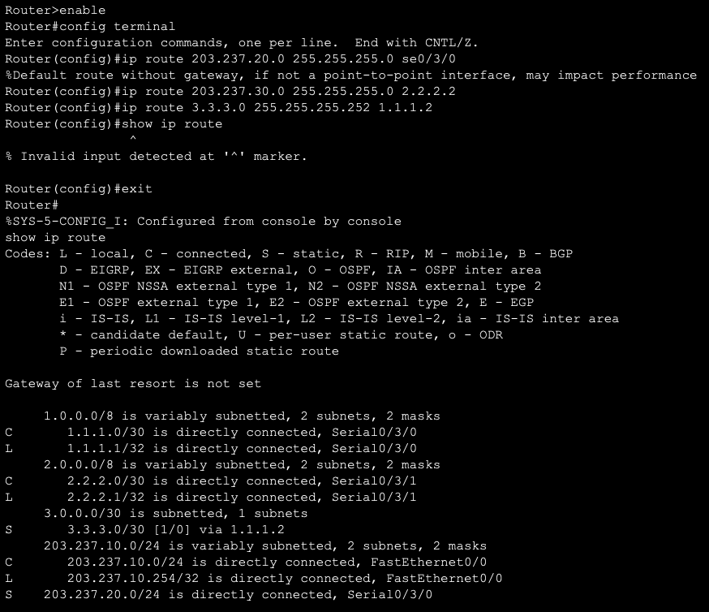

# 패킷트레이서 실습 - 스위치 + 라우터

**날짜: 2025-02-05**

**스크럼**

- 어제 진행한 패킷 트레이서 기초 부분이 재미있었다
- VLAN의 용도와 사용 이유에 대해 배웠다

**새로 배운 내용**

# MAC 주소 테이블 동작 원리

- 스위치와 노드들은 ARP를 이용해 반복적으로 MAC 주소를 교환한다
    - ARP 프로토콜 속 MAC 주소로 테이블을 생성
    - ping 등 패킷이 들어오면 생성된 MAC 주소 테이블을 이용하여 전달
- MAC 주소 테이블은 주기적으로 초기화 되고 최신 정보로 채워진다

# ARP 동작 원리

- IP 주소 이용하여 `ping`
    - PC, Switch, Laptop은 연결포트를 알아내기 위한 과정을 수행
        1. `PC0`이 ARP 요청 패킷을 스위치로 전송 (도착지의 MAC 주소 요청)
            1. 출발지 IP 주소와 MAC 주소
            2. 목적지 IP 주소와 MAC 주소
        2. 스위치가 나머지 노드들에게 MAC 주소를 요청
            1. 출발지의 MAC 주소를 저장
            2. 수신한 패킷을 모든 인터페이스의 노드들에게 전달하고 응답을 요청
        3. 목적지의 응답
            1. 목적지 IP 주소를 가진 디바이스가 출발지의 MAC 주소를 저장
            2. ARP 응답 패킷을 스위치에 전달(출발지-목적지 반대로)
        4. 스위치가 수신한 패킷 처리
            1. 수신한 패킷을 원래의 출발지(`PC0`)로 전달
            2. 출발지와 도착지의 MAC 주소를 테이블에저장
        5. `PC0`이 목적지의 MAC 주소 획득
- ARP로 MAC 주소 테이블을 유지한다
    - 매우 짧은 시간 간격으로 반복 실행 - 노드가 많아지면 부하 가중
    - 보안 상의 문제 - 공격자가 자신의 MAC 주소를 실어 응답 패킷을 보내면 다른 디바이스의 패킷 탈취가 가능해짐
    - **VLAN**으로 해결
        - 내부망 분리와 보호를 위해 사용

# 시뮬레이션

- 패킷트레이서의 시뮬레이션 기능을 통해 실제 패킷의 이동을 확인할 수 있다(이벤트 분석)
    - PDU
    - SRC IP(출발지)
    - DST IP(도착지)
- 이벤트 버퍼를 주기적으로 비워줘야 함

# 라우터 - 모드

- **사용자 모드(User EXEC Mode)**: 기본적인 정보 조회만 가능하며, 설정 변경 불가 - `>`
- **관리자 모드(Privileged EXEC Mode)**: 라우터 설정을 변경할 순 없지만 시스템 정보 상세조회 가능 - `#`
- **글로벌 모드(Global Configuration Mode):** 라우터 설정(이름, 보안, 인터페이스 등)을 변경 - `(config)#`
    - **라인 모드(Line Configuration Mode, `line` 입력):** 콘솔, 원격 접속(Telnet, SSH 등) 관련 설정 변경 - `(config-line)#`
    - **인터페이스 모드(Interface Configuration Mode)**: 라우터의 네트워크 인터페이스(이더넷, 시리얼 등) 설정을 변경 - `(config-if)#`
        - 라우터의 인터페이스에 IP 주소를 설정하고 활성화/비활성화

# 라우터 - 명령어

- 리눅스와 마찬가지로 `TAB`으로 명령어 자동완성
- `shift+ctrl+6`: 기존의 `ctrl+c`와 동일한 동작(자주 쓰겠네)
- `write memory`: 현재 설정값들을 NVRAM에 영구 저장(라우터 메모리)
    - RAM은 휘발성이기 때문에 전원이 꺼지더라도 저장이 유지되는 NVRAM(Non-Volatile RAM)에 저장
- `reload`: NVRAM에 저장된 설정값들을 RAM으로 로드
- `password`: 라우터 접속 보호를 위한 **사용자** 패스워드 설정(설정 다 끝나고 할 것!)
    - `enable password`: **관리자** **평문** 패스워드
    - `enable secret`: **관리자** **암호문** 패스워드
    - **관리자모드** - `show running-config`로 확인
- `banner motd`: 노드 접속 시 출력 메세지 설정
- `hostname`: Router0 같은 노드 이름 변경하기
- 모드 관련 명령어
    
    
    
    | 모드 | 기호 | 주요 명령어 |
    | --- | --- | --- |
    | 사용자 모드 | `>` | `show ip interface brief`, `ping` |
    | 관리자 모드 | `#` | `show running-config`, `show ip route` |
    | 글로벌 모드 | `(config)#` | `hostname`, `enable secret`, `interface` |
    | 라인 모드 | `(config-line)#` | `line console 0`, `password`, `login` |
    | 인터페이스 모드 | `(config-if)#` |  |

# 라우터

- 여러 개의 도시로 연결되는 도로(인터페이스)들이 만나는 교차로에서의 교통 표지판 역할

## 라우팅

- 네트워크 상에서 IP 주소 등을 이용하여 출발지에서 목적지까지 체겨적으로 패킷을 전달하기 위해 경로를 선택하는 과정
- **정적 라우팅**: 관리자가 수동으로 경로를 미리 설정하는 방법
    - 간단한 소규모 네트워크에서 사용
    - 네트워크 상태가 변할 경우 관리자가 갱신
- **동적 라우팅**: 네트워크 상태에 따라 경로를 설정하는 방식
    - 복잡하지만 자동으로 최적의 경로 설정
    - RIP, OSPF, IGRP, EIGRP, BGP 등

## **라우팅 테이블**

- ****라우터로 들어온 패킷을 전달하기 위해 사용하는 테이블

# 패킷 트레이서로 구현해보기

- Laptop0은 통신용이 아니라 Router0을 설정하기 위한 콘솔
    - FastEthernet 케이블이 아닌 RS232(하늘색) 케이블로 연결
- 라우터의 인터페이스
    - 먼저 클릭한 쪽에 시계 모양 - 두 라우터 간 데이터를 주고받기 위한 동기화가 필요
    - 시계 있는 쪽이 동기화를 주도하는 노드 (Data Communication Equipment)
    - 없는 쪽이 따라가는 노드(Data Terminal Equipment

## IP 설정

- 컴퓨터들은 203.237.nnn.nnn/24 사용(C클래스)
- 원격 관리가 필요한 스위치나 서버는 100번 부터
- 라우터는 광역의 랜들을 연결하므로 A클래스 IP 사용
    - 규모가 작아 30비트 서브넷 마스크를 사용하여 최대 4개의 라우터를 묶을 수 있도록
- Router0을 Laptop0으로 설정할 수 있다
    
    
    
    - Fa0/0 인터페이스의 ip를 설정
    
    
    
    - Serial0/3/0 을 Router1과 연결
    - 지금 당장은 Router1이랑 연결이 안될텐데, Router1에서도 no shut으로 켜줘야 함
- Router1 IP 설정
    
    
    
- 스위치 IP 주소 설정
    
    
    

## 연결 확인

- PC0 로컬 호스트(`127.0.0.1`)
    
    
    
- PC0 → Switch1(VLAN1, `203.237.10.100`)
    
    
    
- PC0 → Server0(`203.237.101`)
    
    
    
- PC0 → Router0(`203.237.10.254`)
    
    
    
- PC0 → PC2(`203.237.30.1`)
    
    
    
    - `unreachable` 이 발생한다 - PC0으로 부터 받은 패킷을 Router0이 어느 인터페이스로 보내야할지 모르기 때문 → 라우팅 테이블이 필요하다
- Route0의 라우팅 정보를 보면 PC1, PC2의 정보는 없는 상황
    
    
    

## 정적 라우팅 설정

- 목적지가 `203.237.20.nnn/24` 인 패킷 → Serial0/3/0(`1.1.1.2`)
- 목적지가 `203.237.30.nnn/24` 인 패킷 → Serail0/3/1(`2.2.2.2`)
- 목적지가 `3.3.3.nnn/30` 인 패킷 → Serial0/3/1
- Router0의 정적 라우팅 설정
    
    
    
- Router1의 정적 라우팅 설정
    
    
    
- Router2의 정적 라우팅 설정
    
    
    

## 통신 테스트 - 2차

- PC0 → PC1
    
    
    
- PC0 → PC2
    
    
    
- PC1 → PC2
    
    
    
- Server0 → PC1
    
    
    
- Server0 → PC2

    

**오늘의 도전 과제와 해결 방법**

- 패킷 트레이서로 3개의 라우터를 포함한 네트워크를 구성하여 실생활과 유사한 환경을 테스트해보기

**오늘의 회고**

- 실습 중에 실습 자료를 보고 최대한 똑같이 따라했는데 제대로 작동하지 않아 3시간 이상 낑낑거렸었다 그래서 결국 Q&A에 질문을 올렸었는데 저녁먹고 다시와서 보니 나의 사소한 실수 때문에 생긴 문제였다. 이처럼 배움을 얻고 목표를 이루기 위해 쉼없이 노력을 쏟아붓는 것도 좋지만 휴식을 취하면서 정신을 다잡는 것도 중요함을 느꼈다

**참고 자료 및 링크**
