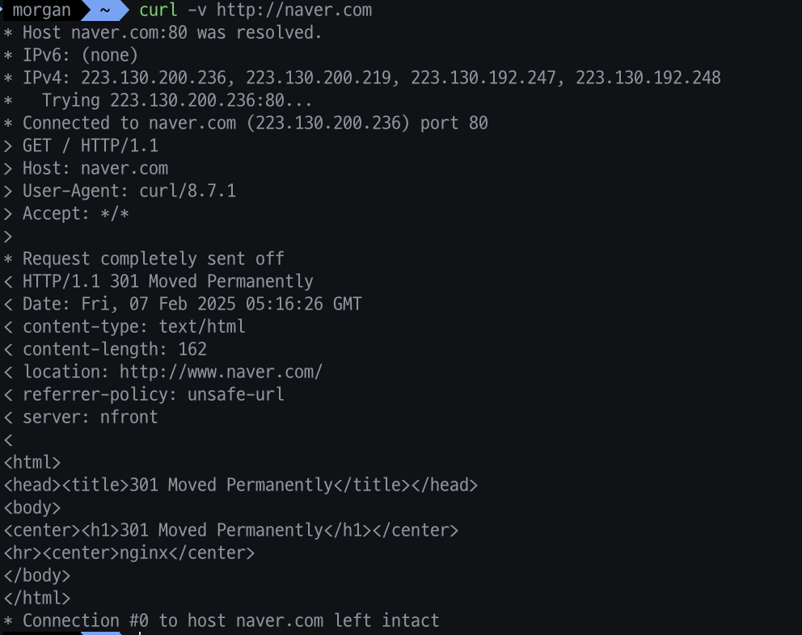
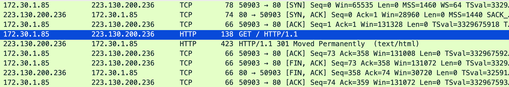

# 오늘의 주제

**OSI 7계층 흐름과 패킷 트래픽 분석**
    
**🔹 주제: 네트워크 패킷 트레이스를 통한 7계층 데이터 흐름 분석**
    
• **설명**: OSI 7계층의 각 계층에서 데이터가 어떻게 처리되고 전달되는지를 실습을 통해 이해합니다.
• **실습 아이디어:**
    Wireshark를 사용하여 **L2~L7 패킷 캡처 및 분석**  
    ◦ ping, traceroute 등을 활용한 계층별 통신 흐름 실습  
    ◦ nc (netcat), curl, telnet을 활용한 L4, L7 계층 트래픽 흐름 확인  
• **활용 툴**: Wireshark, Scapy, Netcat, Traceroute
    

# **ISO 7계층 흐름과 패킷 트래픽 분석**

- ISO 7계층(OSI 모델)의 각 계층에서 데이터가 어떻게 처리되고 전달되는지를 실습을 통해 이해해보기

## Wireshark를 사용하여 **L2~L7 패킷 캡처 및 분석**

- WireShark 설치
    
    
    

### 데이터 링크 계층 (L2) - ARP 분석

- 내 컴퓨터의 IP & MAC
    
    
    
    - IP: `172.30.1.85`
    - MAC: `6a:7b:52:69:42:a9`
- Wireshark 캡처 필터에 `arp`를 입력하고, `Wi-Fi:en0` 을 선택하여 살펴보았다
    
    
    
    - 우리집 네트워크 장비에서 내 컴퓨터로 ARP 요청이 들어와 응답하는 모습

### 네트워크 계층 (L3) - IP 주소 기반 패킷 확인

- 칼리 리눅스 서버(`172.30.1.55`)에서 내 컴퓨터로 `ping` 보내기
    
    
    
- Wireshark로 `icmp` 필터 확인하기
    
    
    
    - Echo (ping) request 라는 요청이 들어온 것을 볼 수 있다

### 전송 계층 (L4) - TCP & UDP 패킷 확인

- TCP 3-Way Handshake 분석하기 (SSH)
    
    
    
    - 내 컴퓨터 → 우분투 서버 SSH 접속
- Wireshark로 `tcp` 필터 확인하기 - 실시간 TCP 통신이 너무 많이 이루어져서 `22` 포트로 한정하여 필터
    
    
    
- SSH 연결 시 TCP 3-Way Handshake 과정은 다음과 같이 이루어진다
    
    
    | **순서** | **출발지 IP** | **목적지 IP** | **출발지 포트 (Source Port)** | **목적지 포트 (Destination Port)** | **설명** |
    | --- | --- | --- | --- | --- | --- |
    | **1** | 클라이언트 (`~~.85`) | 서버 (`~~.81`) | **랜덤 포트 (예: 34567)** | **22** | **SYN (클라이언트가 서버에 SSH 요청)** |
    | **2** | 서버 (`~~.81`) | 클라이언트 (`~~.85`) | **22** | **랜덤 포트 (34567)** | **SYN-ACK (서버가 응답)** |
    | **3** | 클라이언트 (`~~.85`) | 서버 (`~~.81`) | **랜덤 포트 (34567)** | **22** | **ACK (클라이언트가 응답, 연결 완료)** |
    - **22번 포트로 한정했기 때문에, Wireshark에서 가장 처음으로 보이는 통신을 실제론 2번 순서에 해당하는 통신**
- UDP 통신 확인 (Wireshark udp.port == 53으로 확인, 53번 포트가 **DNS 통신용 포트**)
    
    
    
    - `nslookup google.com`을 실행했을 때 **UDP는 TCP와 달리 연결 과정 없이 바로 요청/응답이 발생하는 것을 확인 가능 → 이것이 둘의 가장 큰 차이!!**

### 세션 계층 (L5) - Telnet을 활용한 세션 분석

- 세션 계층에서는 연결 유지 및 관리가 이루어지기 때문에, Telnet을 이용하여 분석할 수 있다
- 우분투 서버에서 Telnet 활성화
    
    
    
- Wireshark에서 TCP 23번 포트(Telnet 용) 필터링
    
    
    
    - Telnet 접속전 TCP 통신으로 연결하는 모습

### 표현 계층 (L6) - TLS/SSL 암호화 분석

- 표현 계층에선 데이터의 암호화 및 압축이 이루어진다
- HTTPS 요청을 보낼때 TLS(SSL) 프로토콜로 데이터를 암호화 한다
- HTTPS 요청 실행
    
    
    
- Wireshark에서 `tls` 필터링을 걸어야 한다(`tcp.port==443`)
    
    
    
    - TLS 핸드셰이크 과정
        - **Client Hello** → **Server Hello** → **Key Exchange** → **Encrypted Data**
- 이후 패킷부터는 Application Data라고 가려져 있다
    
    
    

### 응용 계층 (L7) - HTTP 및 DNS 요청 분석

- 응용 계층(Layer 7)에서는 웹 트래픽(HTTP), 이메일, FTP, DNS 등의 실제 응용 서비스가 동작
- HTTP 요청 실행
    
    
    
- Wireshark 에서 `tcp.port == 80` 으로 필터링
    
    
    
    - 웹 개발할 때 자주 보이는 `GET / HTTP/1.1` 도 보인다

# 회고

- Wireshark를 통해 알아본 실제 각 계층관 데이터가 전달되는 과정을 정리하고 이해할 수 있었다
- 이를 기반으로 웹 트래픽 상황에서의 캡슐화 절차를 간단히 나타내보면
    
    ```jsx
    L7 (응용 계층) - HTTP 요청 (curl 실행)
    ↓ **(Wireshark에서 `http` 또는 `tcp.port==80` 필터로 확인 가능)**
    L6 (표현 계층) - TLS로 암호화됨
    ↓ **(Wireshark에서 `tls` 필터로 확인 가능)**
    L5 (세션 계층) - HTTPS 세션 생성
    ↓ **(Telnet 세션과 비교 가능)**
    L4 (전송 계층) - TCP 3-Way Handshake로 연결
    ↓ **(Wireshark에서 `tcp.port == 443` 필터로 확인 가능)**
    L3 (네트워크 계층) - IP 주소 기반으로 패킷 전송
    ↓ **(Wireshark에서 `ip.addr == 대상 IP` 필터로 확인 가능)**
    L2 (데이터 링크 계층) - ARP를 통해 MAC 주소 확인 후 전달
    ↓ **(Wireshark에서 `arp` 필터로 확인 가능)**
    L1 (물리 계층) - Wi-Fi or LAN 케이블을 통해 전송
    ```
    
- 웹 트래픽뿐만 아니라 SSH, DNS 요청 등의 흐름도 유사하게 정리할 수 있다