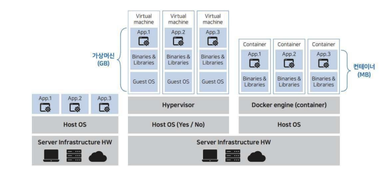
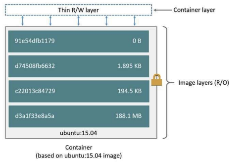

# 도커 & 쿠버네티스

- AWS ECS(Elastic Container Service)
    - 도커 컨테이너 역할
    - 태스크 정의로 자동화
- AWS ECR(Elastic Container Registry)
    - 도커 허브 역할
- AWS EKS(Elastic Kubernetes Service)
    - 클러스터 관리 - 마스터 노드 & 워커 노드
    - 서비스 스펙 관리
- CodeDeploy와 연계하여 CI/CD 구성
    - 이미지화하여 배포

# 🐳 Docker

- 리눅스 컨테이너에 여러 기능을 추가
- 애플리케이션을 컨테이너로 좀 더 쉽게 사용할 수 있게 만든 **오픈소스 프로젝트**
- 가상 머신과 달리 **성능 손실이 거의 없는** 차세대 클라우드 솔루션
    - 주로 EC2 인스턴스 활용 - 안정성 + Auto scaling
    - 백엔드: API Gateway → Network Load Balancer → ingress NGINX → Pod
    - 프론트엔드: CloudFront + S3
    - EKS, ArgoCD, Helm chart
- **핵심: 설치보다는 미리 세팅된 이미지를 다운받는다는 개념**

## 로컬 vs 가상머신 vs 컨테이너

- 가상머신 - HostOS 위에 Hypervisor(QEMU)
    - Hypervisor를 통한 가상화 → 성능 손실 - 1주차 때 CPU/메모리/디스크 설정해줬던 것을 기억하죠?
    - 완벽한 독립적 공간을 생성하지만 이미지 용량이 크고 가상머신 배포에 부담이 된다
- 컨테이너 - HostOS 위에 Docker 엔진(컨테이너)
    - 컨테이너에 소스 배포 → 이미지화 → 레지스트리에 push
    - 프로세스 단위 격리 환경을 구성 → 애플리케이션 구동을 위한 라이브러리만 포함된 이미지 생성하므로 용량이 작은 편
    - `limit`이라는 명령어로 자원 소모량에 제한을 정해둘 수 있다

## LXC (LinuX Container)

- 자원과 사용자를 분리하는 리눅스 커널의 기술
- `chroot`(change root)
    - 특정 디렉토리를 root 디렉토리로 인식하게 설정 - 특정 영역에 접근을 제한
- **Cgroup(Control group)**
    - 시스템 자원을 제한하고 격리하는 기능
- **Namespace**
    - 시스템 자원을 해당 프로세스에만 해당되는 자원처럼 보이도록 하여 다른 프로세스와 격리시키는 가상화 기능
    - mnt, pid, net, ipc, user 등의 자원을 그룹화 하여 할당
- GitLab - GitLab Runner → Docker
- GitHub - GitHub Action

## 컨테이너의 장점

- 경량화 - 이미지 복제, 이관, 배포가 쉽고 효율적이다
    - CodeDeploy, ArgoCD → 배포의 **Versioning**
- 게스트 OS 부팅X - 컨테이너 수행 시간이 빠르다
- 한정된 하드웨어 자원 안에서 VM보다 더 많은 컨테이너를 효율적으로 실행할 수 있다

## 도커 이미지

- 가상머신  생성 시 사용하는 ISO 이미지와 비슷한 개념
- 여러 개의 층으로 된 바이너리 파일로 존재 - `Dockerfile`
- 컨테이너 생성 시 읽기 전용으로 사용
- 명령어로 레지스트리로부터 다운로드
    - 저장소 이름/이미지 이름:이미지 버전
        - 저장소 이름이 없으면 도커 허브로 인식
        - 이미지 이름은 생략 불가능
        - 이미지 버전이 생략되면 `latest` (최신)
    - `morgan/ubuntu:24.04`

## 도커 컨테이너

- 도커 이미지로부터 생성되는 격리된 파일시스템, 시스템 자원, 네트워크를 사용할 수 있는 독립공간
- 도커 이미지 목적에 맞게 컨테이너를 생성
- 이미지를 읽기 전용으로 사용, 이미지 변경 데이터는 컨테이너 계층에 저장
- 컨테이너의 애플리케이션 설치/삭제는 다른 컨테이너에 독립적
- **도커 철학 → 컨테이너에 하나의 애플리케이션(프로세스)만 실행**
- 컨테이너 간 독립성 보장으로 버전관리 및 소스 모듈화 등에 용이
- 컨테이너 = 도커
- 나머지(EKS, ECS 등) = 오케스트레이션 툴

## 도커 명령어

- `run`: 컨테이너 실행
    - `-p`: 호스트 포트와 컨테이너 포트 연결 옵션 - 포트 추가 명령은 없기 때문에 재실행해야 함
    - `-v`: 호스트의 디렉토리 및 파일을 컨테이너의 디렉토리 및 파일과 공유
- `commit`: 이미 컨테이너 내부에 추가 작업이 많았는데 재시작해야 하는 경우 컨테이너를 이미지화
- `-i`: 컨테이너와 상호 입출력 가능 옵션
- `-t`: 셀을 사용할 수 있는 tty 활성화
- `exit` 또는 Ctrl+D: 컨테이너 빠져나오면서, **컨테이너 정지**
- Ctrl+P, Q: 컨테이너 정지하지 않고 빠져 나오기
- `create`: 컨테이너 생성(실행X)
- `--name`: 컨테이너 이름 지정
- `start`: 컨테이너 시작
- `attach`: 컨테이너 들어가기
- `docker ps`: 실행 중인 컨테이너 목록
    - `-a` 옵션: 중지된 컨테이너까지
    - `-q` 옵션: ID만 출력
- `rm`: 컨테이너 삭제(중지된 컨테이너만)
    - `rm -f`: 실행중인 컨테이너 삭제
- `stop`: 컨테이너 중지
- `inspect <이미지명>`: 레이어 정보 확인
- `history <이미지명>`: 이미지 생성 히스토리
- `rmi <이미지명>`: 이미지 삭제
    - 사용 중인 컨테이너가 없어야 함
- 실행중인 컨테이너에 접근하여 명령어를 수행하고자 할 때 사용하는 명령어
    - `attach <컨테이너 id>`: 처음 컨테이너를 실행 시켰을 때의 환경이 보여짐
    - `exec -it <컨테이너 id> /bin/bash`: 컨테이너 내부에 쉘로 접근

## 도커 이미지

- `commit` 할 때마다 이미지 레이어가 쌓인다
- 컨테이너와 이미지는 클래스 - 객체 구조와 유사
- 도커 이미지는 도커 허브(중앙 저장소)에서 다운로드
    - 계정 생성 및 로그인 필요
- `docker create`, `run`, `pull` 로 이미지 다운로드
- 이미지 저장소를 직접 구축할 수 도 있다 - 사설 레지스트리
- `search` → `OFFICIAL`에 `[OK]` 표시된(공인된) 곳에서 다운로드하는 것을 권장

### 생성 방법

- 구동중인 컨테이너에 있는 그대로 이미지로 만들기 - 긴급할 때 주로 사용
    1. 기본 OS 이미지로 컨테이너 생성
    2. 애플리케이션 설치 및 환경설정, 소스코드 복제(수작업)
    3. 컨테이너 이미지 커밋
- Dockerfile을 이용하여 생성 선언하기 - 대부분의 경우
    1. 매뉴얼 작업을 기록한 `Dockerfile` 생성(자동화)
    2. 빌드 명령어가 `Dockerfile`을 읽어 이미지 생성

### 배포 방법

- 파일 배포
    - 추출한 이미지 파일 복사 후 저장
    - 파일 용량이 커지거나 이미지가 많아지면 배포가 어려워짐
    - `docker save`: 컨테이너 커맨드, 이미지 이름과 태그, 메타데이터 포함 추출
        - `-o` 옵션으로 추출될 파일명 지정
    - `docker load`: 파일에서 이미지를 로드
    - `docker export`: 컨테이너를 파일로 추출
    - `docker import`: 파일에서 새로운 이미지로 저장
    - load는 이미지에 레이어와 컨테이너 정보 포함
    - import는 이미지에 컨테이너 정보가 없고 기존 레이어 대신 새로운 레이어로 존재. env, cmd 등을 다시 설정해줘야 정상 동작 - Entrypoint를 `/bin/bash`로 지정
- 이미지 배포 - Public Registry(도커 허브, ECR, Azure Container Registry 등)
    - 이미지 클라우드 저장소(https://hub.docker.com)
    - `docker commit`으로 이미지를 만들고 `docker tag`로 이름을 부여한 뒤, `docker push`로 업로드
    - `docker stop`, `docker rmi`로 컨테이너 중지, 삭제
    - `docker images`: 이미지 리스트
    - docker pull <이미지명>: 저장소에서 내려받기
- 이미지 배포 - Private Registry
    - 사용자가 직접 레지스트리를 구성
    - 저장소 서버, 저장공간을 직접 관리
    - 사내망 같은 환경에서 이미지 배포 시 활용하는 방법 - 보안성 확보
    - 도커 허브에서 레지스트리 이미지를 받아와서 설치
    - `docker run -d --name <이름> -p … --restart=always registry`
        - `restart=always`: 컨테이너 정지되면 재시작, 도커 엔진 재시작 시 컨테이너 재시작
        - `restart=on-failure`: 컨테이너 종료코드가 0이 아닐때 최대 5번 재시작 시도
        - `restart=unless-stopped`: 컨테이너를 정지시키면 도커 엔진 재시작 해도 컨테이너 재시작X
    - 명시한 포트로 올라온 이미지 확인할 수 있다
    - 도커 데몬은 기본적으로 https를 통한 접근만 허용하기 때문에 엔진 옵션을 변경해야한다
        - `/etc/docker/daemon.json` 에 insecure-registries 추가

## 도커 볼륨

- 컨테이너 레이어에 저장하기
    - 이미지로 컨테이너 생성 → 읽기전용
    - 컨테이너 변경정보는 변경사항만 별도로 저장, 컨테이너 정보 보존
    - **컨테이너 레이어의 데이터는 컨테이너 삭제와 함께 삭제되어 복구 불가**
- 볼륨에 저장하기
    - 컨테이너 데이터를 영구적으로 보관하는 저장 방식
    - 호스트볼륨을 공유, 볼륨 컨테이너, `docker volume` 이용가능
- Stateless: 데이터를 외부 볼륨에 저장
- Stateful: 데이터를 컨테이너 내부에 저장

### 볼륨 사용법

- Host의 폴더를 직접 공유
    - Host에 파일을 추가 → 컨테이너 하나를 실행시키고 볼륨을 공유하여 컨테이너에서 Host 폴더에 추가된 파일  제공(덮어쓰기)
- 볼륨 컨테이너 공유
    - -v 옵션으로 볼륨을 사용하는 컨테이너를 공유 또는 커넽이너 생성 시 볼륨 자동 생성
- 도커가 지원하는 `volume` 사용
    - 컨테이너끼리 종속적이지 않다
    - Host에서의 저장 위치가 어디인지 몰라도 된다 - 도커가 관리
    - `docker volume create`으로 생성
    - `docker volume inspect`: 볼륨 정보(Mountpoint)
    - `docker volume rm`으로 삭제 - 컨테이너를 삭제해도 볼륨은 남는다

## Infra as Code(IAC)

- 인프라가 코드로 관리된다
- 인프라 설치를 사람이 **직접하는 게 아니라** 설치 시 할 일을 미리 코드로 선언
- **특징**
    - 이미지 생성 자동화
    - 인프라의 변동 관리 - 버전 관리 도구
    - 빠른 복구 - 복구 상황 기술
    - 빠른 배포 - 파일로 전달(이미지 대신 `Dockerfile` 자체를 배포)
    - 내부 내용을 명확히 확인 - `Dockerfile`의 내용으로 손쉽게 확인

## Dockerfile

- 컨테이너 빌드에 필요한 작업 명령이 저장된 파일
- 도커 엔진은 `Dockerfile` 이름을 인식하여 이미지 생성(`docker build`)
- 한 줄이 하나의 명령어 - 대소문자 상관없지만 대문자 사용이 일반적
    - `FROM`: 베이스가 될 이미지(운영체제 등의 환경 세팅)
    - `LABEL`: 이미지에 메타데이터 추가 - `키=값` 형태, `docker inspect`로 확인
    - `RUN`: 이미지 생성을 위한 컨테이너 내부 명령어 - 쉘 정의가 필수(`RUN [”sh”, “-c”, “echo $MY_ENV”]` )
    - `ADD`: `Dockerfile`이 위치한 디렉토리의 파일 → 이미지에 추가
    - `WORKDIR`: 명령어를 실행할 디렉토리 정의 - `cd`와 같은 기능
    - `EXPOSE`: 노출할 포트 정의 - 외부 통신
    - `CMD`: 컨테이너가 시작될 때 실행되는 명령 설정
    - `ENV`: 사용할 환경변수 설정(env파일 빌드 후 실행 옵션(`-e`)으로 설정하는 방법도 있다)
    - `VOLUME`: 호스트와 공유할 컨테이너 내부 디렉토리 설정
    - `ARG`: Dockerfile 내에서 사용될 변수값 설정
        - 빌드의 `--build-arg` 옵션으로 지정해줄 수 있다
    - `USER`: 사용자 계정을 설정하여 그 이후 명령은 해당 사용자의 권한으로 실행
    - `HEALTHCHECK`: 이미지로부터 생성된 컨테이너의 애플리케이션 상태 체크 루틴
        - curl 동작을 일정 주기로 반복시키는게 일반적 - 실패 시 unhe
    - `COPY` :  로컬 디렉토리에서 읽어들인 컨텍스트(파일만)를 이미지 파일에 복사
    - `ADD`: 로컬파일, URL, tar 파일 등도 복사
- `FROM`부터 한줄씩 읽으며 `ADD`, `RUN` 이 실행될 때마다 컨테이너 레이어 생성
    - `&&\`로 하나의 명령어처럼 만들어 이미지 레이어 줄일 수 있다 - 공간 절약
    - `ENTRYPOINT`와 `CMD`의 차이점
        - `CMD`는 `/bin/bash`가 실행되고, `ENTRYPOINT`는 `echo`가 실행되어 커맨드를 인자로 사용
- 최종 이미지 생성될 때까지 임시 컨테이너 레이어 생성 후 삭제

### 캐시를 이용한 빌드

- Dockerfile 생성
- `docker build -f`: 빌드에 사용할 Dockerfile 지정할 때 이전에 빌드한 것과 같은 내용이 있다면 이전 이미지 활용
- `--cache-from`으로 이용할 캐시를 직접 지정하거나 `--no-cache`로 캐시를 비활성화할 수 있다

### 멀티스테이지 도커 빌드

- 여러 단계로 나뉘어서 작업하고 합치기 위한 목적
- 이미지를 분리할 수 있다
    - 하나의 이미지에서 컴파일과 운영까지 하면 이미지 사이즈가 너무 커진다 → 컴파일 환경과 운영 환경을 분리하자
    - 예시) https://github.com/docker/awesome-compose/blob/master/spring-postgres/backend/Dockerfile
- `ONBUILD`: 빌드된 이미지를 기반으로 하는 다른 이미지가 Dockerfile로 실행될 때 실행할 명령어를 추가
    - `ONBUILD RUN echo “onbuild!” >> /onbuild_file`

# 🐙 Docker Compose

- 여러 개의 컨테이너가 하나의 애플리케이션으로 동작할 때, 일일이 생성하기 번거롭기 때문에 서로 연관된 여러 컨테이너를 한꺼번에 생성시킬 필요가 있고, 이것을 묶음으로 관리할 수요가 많았다
- 도커 컴포즈는 여러 컨테이너를 하나의 프로젝트로서 다룰 수 있는 작업 환경을 제공한다
    - 서비스의 컨테이너화
- `docker compose up/down`: 컨테이너 실행/종료
- 기본적으로 프로젝트의 이름은 `docker-compose.yml`이 위치한 디렉토리 이름
    - `-p` 옵션으로 별도 지정 가능(`docker compose -p project1 up -d`)
    - `-d`(detached)는 백그라운드 실행
- 도커 컴포즈 예제: https://github.com/docker/awesome-compose
- 이전에 우리가 AMP 다운받고 지지고 볶고 해서 올린 Wordpress
    
    → `docker compose up`으로 딸깍