# 오늘의 주제
** 도커 실습 - 기본**

# Docker 설치하기

- 난 이전 프로젝트 중에 설치했다

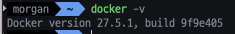

# 컨테이너 다루기

- 컨테이너 실행
    
    ```bash
    docker run -i -t ubuntu
    ```
    
- 이미지 내려받기
    
    ```bash
    docker pull centos:7
    ```
    
- 컨테이너 생성하기
    
    ```bash
    docker create -i -t --name mycentos centos:7
    ```
    
- 컨테이너 시작 및 들어가기
    
    ```bash
    docker start mycentos
    docker attach mycentos # 컨테이너 ID 사용 가능
    ```
    
- 컨테이너 목록
    
    ```bash
    docker ps
    docker ps -a # 실행중이지 않은 컨테이너까지
    docker ps -a -q # ID만 출력
    ```
    
- 이름 바꾸기
    
    ```bash
    docker rename mycentos yourcentos
    ```
    
- 중지 및 삭제하기
    
    ```bash
    docker stop friendly_perlman
    docker rm ubuntu  # 중지된 컨테이너 삭제
    docker rm -f yourcentos  # 실행 중인 컨테이너 삭제
    ```
    

# 컨테이너 애플리케이션 구축 - Apache 서버 구축

```bash
docker run -it -p 80:80 ubuntu
~/# apt-get update
~/# apt-get install apache2
~/# apt-get install net-tools
~/# sevice apache2 start
~/# netstat -ntlp
```

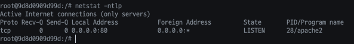

- Apache 서버가 80번 포트에 실행된 모습
    
    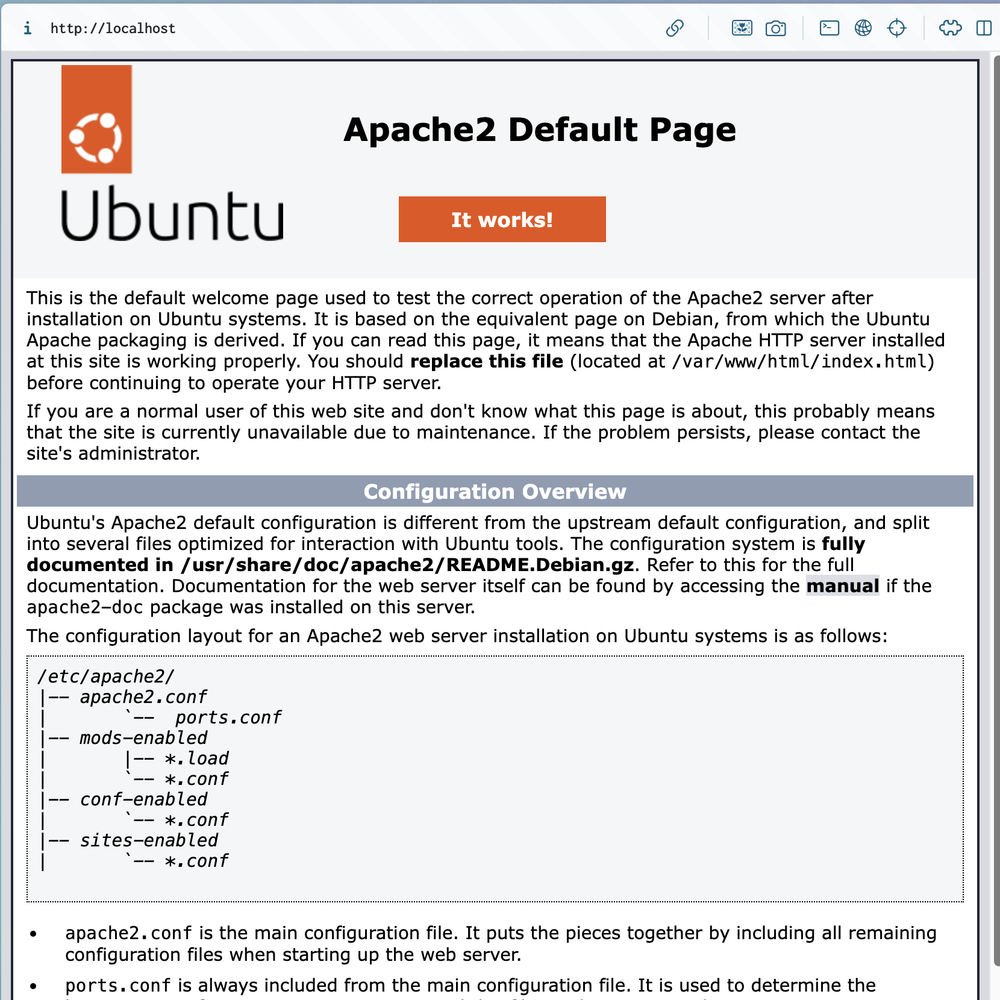
    
    - http://localhost로 접속했을 때 apache 기본 페이지가 나온다

# 이미지 생성

- 시나리오
    1. 도커 허브에서 NGINX 이미지를 불러와 컨테이너로 동작시킨다
    2. NGINX의 기본 `index.html` 을 수정한다
    3. 저장하여 새로운 `commit_test:1.0` 이미지로 만든다
    4. `commit_test:1.0` 이미지로 새로운 컨테이너를 띄운다
    5. 새로운 `index.html`을  host에서 cp한다
    6. 해당 컨테이너를 이미지화 한다 - `commit_test:2.0`
- 이미지 생성을 위한 컨테이너
    
    ```bash
    docker run -it --name commit_test_container -p 9999:80 nginx
    
    docker exec -it commit_test_container /bin/bash
    ```
    
    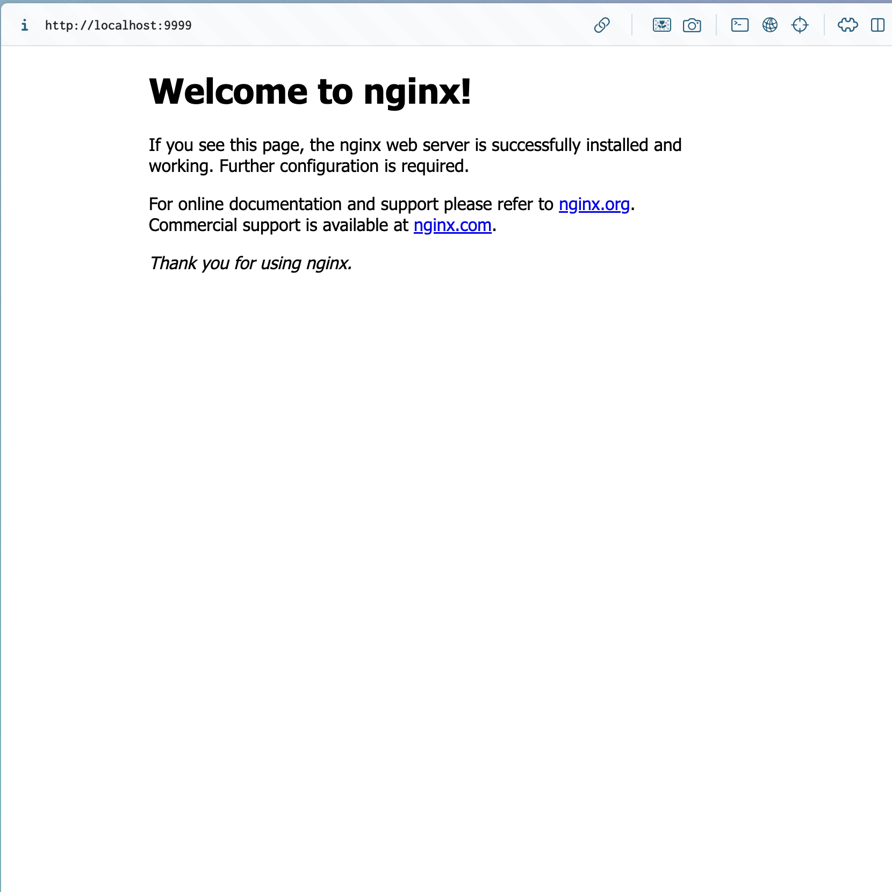
    
    - NGINX가 실행된 모습 - 현재 페이지가 `index.html`이다
- `index.html`을 찾아 수정
    
    ```bash
    find / -name index.html
    
    apt-get update
    ```
    
    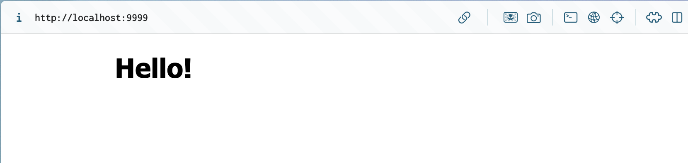
    
    - 동일한 경로의 내용이 바뀌었다
- 이미지 만들기
    
    ```bash
    docker commit -a "morgan" -m "my first commit" commit_test_container commit_test:1.0
    ```
    
    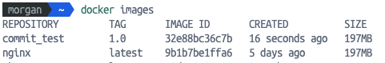
    
- 생성된 이미지로 다시 컨테이너 생성
    
    ```bash
    docker run -d --name commit_test2_container -p 8888:80 commit_test:1.0
    ```
    
- index.html 다시 변경 - cp 사용 + `docker commit`
    
    ```bash
    docker cp <경로명> commit_test2_container:/usr/share/nginx/html/index.html
    ```
    
    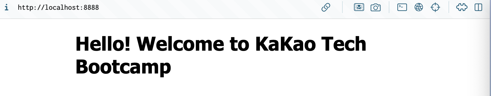
    
- 도커 이미지 레이어 보기
    
    ```bash
    docker inspect <이미지명> # "Layers" 부분을 잘 보면 된다
    
    docker history <이미지명>
    ```
    

# 이미지 삭제

```bash
docker rmi commit_test:1.0
```

- commit_test:1.0을 사용중인 컨테이너가 있기 때문에 컨테이너를 먼저 지워야 한다

# 이미지 배포 - Public Repository

- 이미지 만들어 이름 부여하기
    
    ```bash
    docker commit commit_container1 dmimage:0.0
    
    docker tag dimiage:0.0 koojun99/dmimage:0.0 # 이름 지정
    ```
    
- 저장소에 이미지 올리기
    
    ```bash
    docker push koojun99/dmimage:0.0
    ```
    
    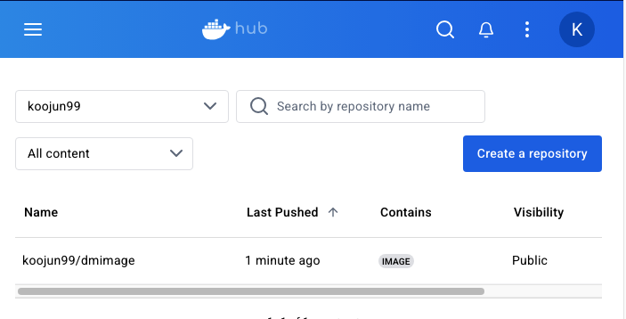
    
- 이미지 삭제하고 내려받아보기
    
    ```bash
    docker pull koojun99/dmimage:0.0
    ```
    
    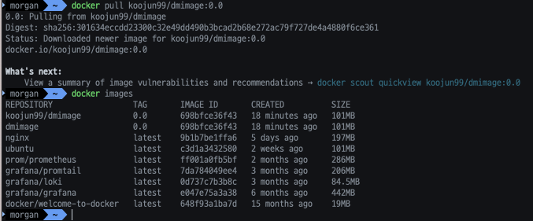
    

# 이미지 배포 - Private Registry

- Private Registry 생성
    
    ```bash
    docker run -d --name private -p 8888:5000 --restart=always registry
    ```
    
- http://localhost:8888/v2 로 확인
    
    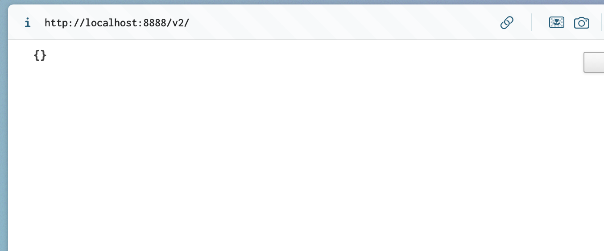
    
    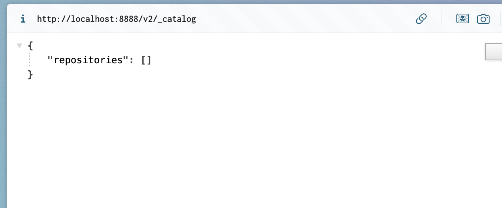
    
- 사설 레지스트리에 푸시
    
    ```bash
    docker tag dmimage:0.0 localhost:8888/dmimage:0.0
    
    docker push localhost:8000/dmimage:0.0
    ```
    
    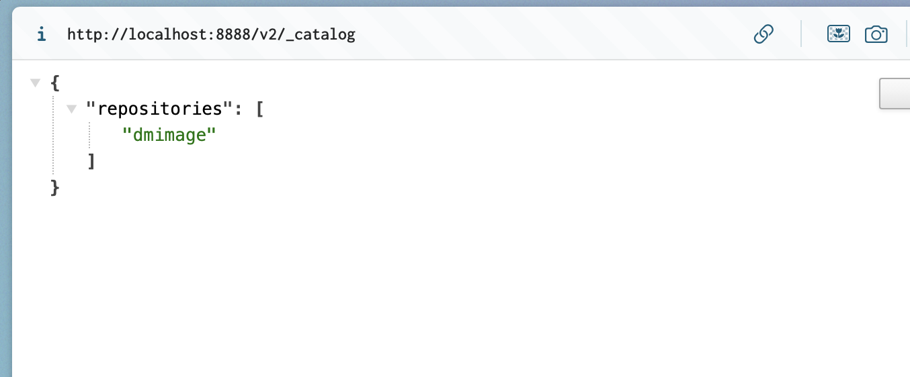
    

# 도커 볼륨

- Host 볼륨, 볼륨 컨테이너 공유, 도커 볼륨 3가지의 방법

## Host 볼륨

- 호스트 공유 볼륨 확인 및 컨테이너 생성
    
    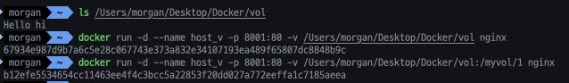
    
- 컨테이너에 공유된 볼륨 `/myvol/1` 확인
    
    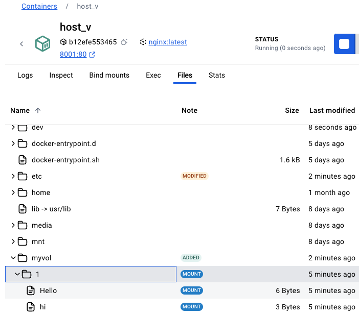
    

## 볼륨 컨테이너 공유

- `host_v` 컨테이너 자체를 다른 컨테이너와 공유
    
     
    
    ```bash
    docker run -d --name newcontainer --volumes-from host_v -p 8002:80 nginx
    ```
    
    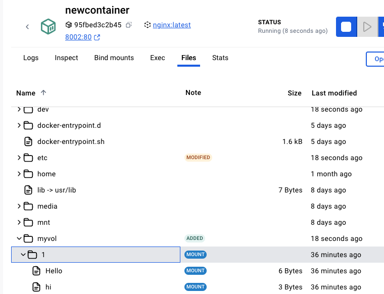
    

## Docker volume 기능

- 특징
    - 컨테이너끼리 종속적이지 않다
    - 호스트에서 파일 저장 위치가 어디인지 몰라도 된다
- 볼륨 생성
    
    ```bash
    docker volume create --name myvol
    ```
    
- 컨테이너 실행
    
    ```bash
    docker run -d --name my_volume -v myvol:/my_volume/vol -p 9001:80 nginx
    ```
    
    - 볼륨의 마운트 위치 확인
    
    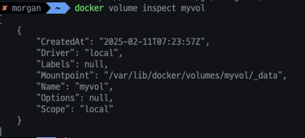
    
- 볼륨 삭제
    - 볼륨은 컨테이너가 삭제되어도 남기 때문에 직접 삭제해줘야 함
    
    ```bash
    docker volume rm myvol
    ```
    

# Dockerfile

- `Dockerfile` 작성

```bash
FROM ubuntu:14.04
LABEL "purpose"="practice"
RUN apt-get update
RUN apt-get install apache2 -y
ADD test.html /var/www/html
WORKDIR /var/www/html
RUN ["/bin/bash", "-c", "echo 'Hello World' > test2.html"]
EXPOSE 80
CMD apache2ctl -D FOREGROUND
```

- Apache 서버를 설치하여 로컬에 있는 test.html을 컨테이너 상 `/var/www/html`로 복사
- 빌드 시, 쉘 명령어를 실행( `-c` 옵션으로 문자열을 명령어로 해석하도록 설정)시켜 `test2.html` 을 생성하여 “Hello World” 작성
- 빌드하기
    
    ```bash
    docker build -t mybuild:0.0 .
    ```
    
- 컨테이너 실행
    
    ```bash
    docker run -d -P --name myserver mybuild:0.0
    ```
    
    - `-P`: `EXPOSE`로 노출된 포트를 호스트에서 사용 가능한 포트에 차례로 연결
- `docker port myserver`로 연결된 포트 확인 후 연결(55000)
    
    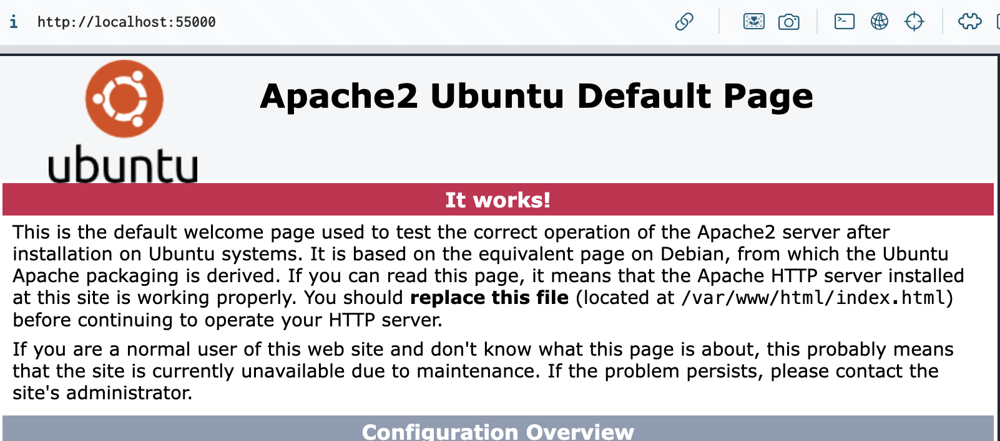
    
- `test2.html` 확인
    
    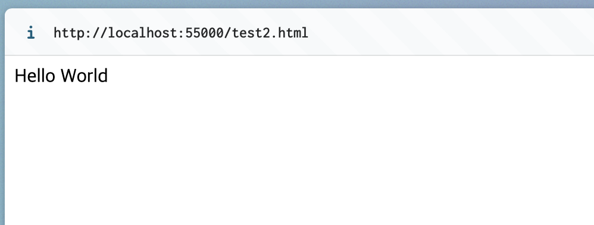

# 오늘의 회고
간단한 CI/CD 도구로만 사용했던 도커를 더욱 폭넓게 사용해보면서 왜 현재 대세가 도커 & 쿠버네티스인지 알게 되었다