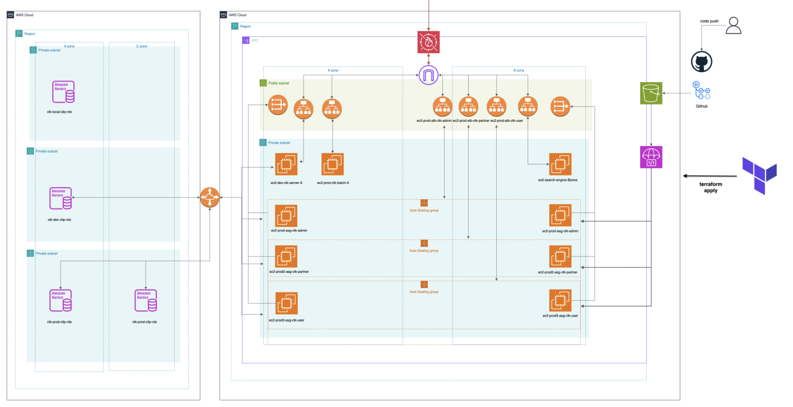
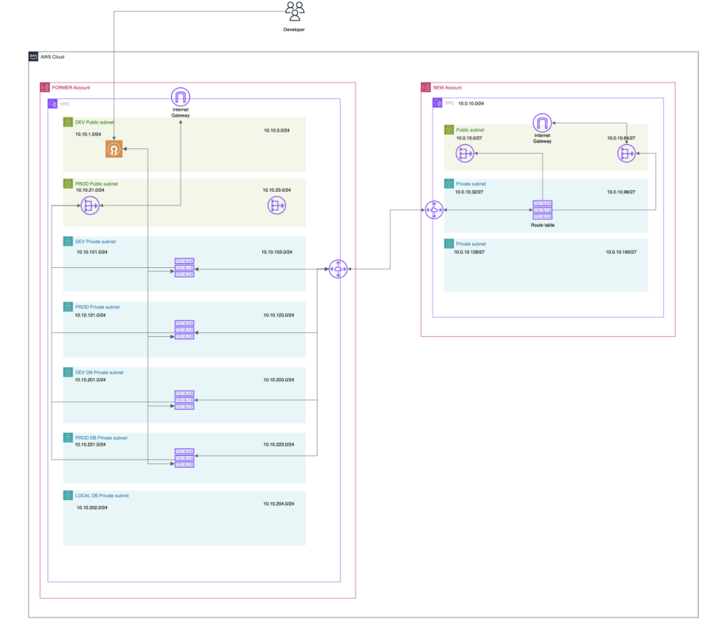

# 클라우드에서

- CodeDeploy를 주로 활용
- 배포 성공/실패를 슬랙으로 알림
- `appspec.yml`로 특정 절차를 지정해줌
    - 실질적인 동작을 기술

# GitLab

- **Git 저장소 관리, CI/CD(Continuous Integration & Continuous Deployment), 이슈 트래킹, 코드 리뷰 등을 하나의 플랫폼에서 제공하는 DevOps 도구**
- GitHub, Bitbucket과 같은 **Git 기반 코드 저장소 관리 시스템**이지만**, 자체 호스팅(On-Premise)**도 가능하고 **강력한 CI/CD 기능**을 기본 제공한다
    - CI/CD 중에 빌드→테스트→배포 과정을 거친다
- 프로젝트의 이슈(버그, 기능 요청) 관리 가능
- **Merge Request(MR)** 기능을 통해 코드 리뷰 프로세스 지원
- GitHub와 달리 **자체 서버에 설치 가능 (Self-hosted)**
- **보안 및 내부 네트워크에서만 운영 가능**
- GitHub Enterprise와 유사하지만 오픈소스 기반

# 버전관리 시스템

- 다양한 파일을 만들고 변경하게 된다
- 편집 중에 가끔 잘못 저장할 수 도 있고 지웠던 내용이 다시 필요해질 수도 있다
- 백업 파일을 만들 수도 있지만 그 수가 너무 많아질 우려가 높다
- **버전 관리 시스템의 주요 기능**
    - 파일을 언제, 누가, 왜, 어떻게 변경했는가 기록
    - 과거의 특정 시점으로 파일을 복원

# 아키텍처 예시 -AWS

- VPC 피어링
    - VPC 간 통신을 관리(서버-DB)
- 무중단 배포
    - LB가 추가 인스턴스를 생성한 다음, 배포 완료가 되면 기존에 있던 구버전으로의 접속을 차단 후 삭제
- 테라폼
    - `Tf init`
    - `Tf plan`
    - `Tf apply`
    - 코드로 서버의 변경사항을 기술(인스턴스를 몇 개 추가할지, 로드 밸런서의 동작 등)
- Cloud Watch
    - 자원 사용량 모니터링(메트릭)
    - 에이전트를 설치해 더 상세한 메트릭을 볼 수 있다
    - 쿠버네티스 환경 모니터링 솔루션 - Data Dog, Whatap
- AWS의 오케스트레이션 서비스: ECS - Docker, EKS - k8s
- 네트워크 구조

- SSL VPN으로 사설 IP와 암호화 통신 (Bastion Host도 가능은 함)

# 클라우드 별 특징

- IBM - 물리 환경 강점
- AWS - 보편적으로 양질의 기능 but 비용 높음
- Microsoft Azure - 윈도우 최적화
    - 이미지 배포(`Dockerfile`) → 레지스트리로 푸시 → ArgoCD(k8s) 통해 배포
- 국내 기업 - 공공기관 특화 - 가성비