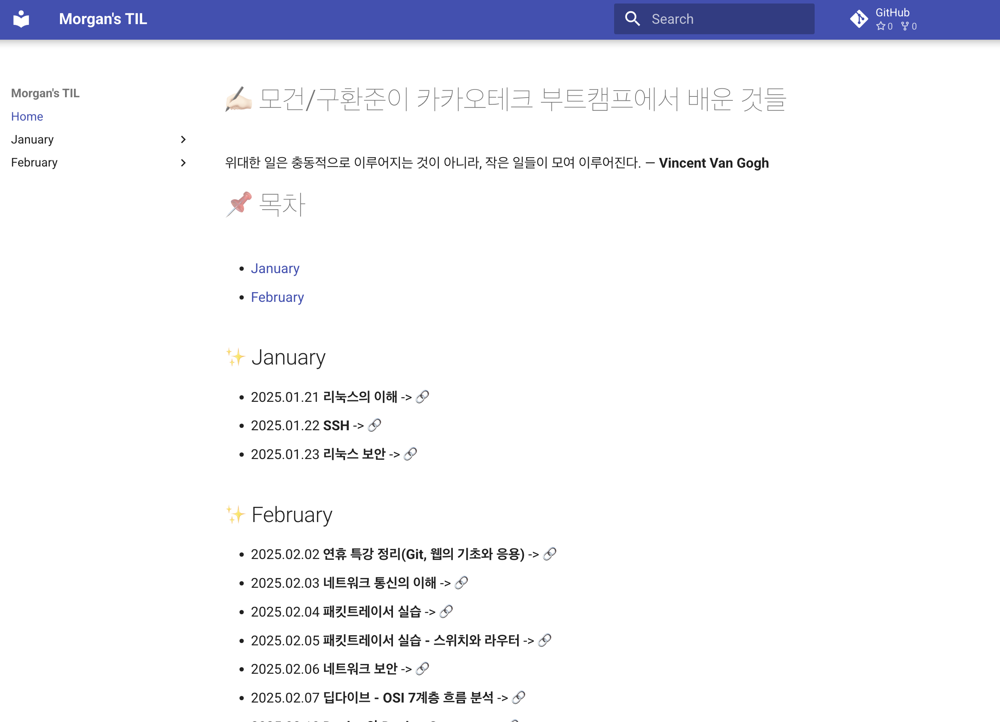

# 나만의 도커 이미지 만들기

- MkDocs를 이용하여 나의 카카오테크 부트캠프 TIL 페이지를 GitHub에서 다운받아 도커 이미지로 배포해보기로 했다

### MkDocs 활용을 위한 세팅

- `mkdocs.yml` 작성
    
    ```bash
    site_name: "Morgan's TIL"
    site_url: "https://your-til-site.com"
    repo_url: "https://github.com/100-hours-a-week/morgan.koo-TIL"
    
    theme:
      name: "material"
    
    docs_dir: "docs"
    
    nav:
      - Home: README.md
      - January:
          - "리눅스의 이해": Jan/2025-01-21.md
          - "SSH": Jan/2025-01-22.md
          - "리눅스 보안": Jan/2025-01-23.md
      - February:
          - "연휴 특강 정리 (Git, 웹의 기초와 응용)": Feb/2025-02-02.md
          - "네트워크 통신의 이해": Feb/2025-02-03.md
          - "패킷트레이서 실습": Feb/2025-02-04.md
          - "패킷트레이서 실습 - 스위치와 라우터": Feb/2025-02-05.md
          - "네트워크 보안": Feb/2025-02-06.md
          - "딥다이브 - OSI 7계층 흐름 분석": Feb/2025-02-07.md
          - "Docker와 Docker Compose": Feb/2025-02-10.md
          - "Docker 실습 - 기본": Feb/2025-02-11.md
    
    markdown_extensions:
      - toc:
          permalink: true
      - admonition
      - pymdownx.details
      - pymdownx.superfences
    
    plugins:
      - search
    
    extra:
      social:
        - icon: fontawesome/brands/github
          link: "https://github.com/100-hours-a-week/morgan.koo-TIL"
    ```
    
    - 사이트 이름, 끌어 올 레포지토리, 테마, 플러그인 등을 설정할 수 있다
    - `docs_dir`로 mkdocs가 탐색할 파일들의 위치를 정해주었다
    - 작성 완료 후 깃허브에 푸시해주었다

### Dockerfile 작성

- GitHub에 저장된 내용을 Docker로 배포하여 언제든지 실행할 수 있도록 설정

```docker
# Python 3.9 기반 이미지 사용 - MkDocs가 파이썬 기반이기 때문
FROM python:3.9

# 필수 패키지 설치
RUN apt-get update && apt-get install -y git

# 작업 디렉토리 설정
WORKDIR /app

# GitHub에서 TIL 리포지토리 클론 (최신 내용 유지)
RUN git clone https://github.com/100-hours-a-week/morgan.koo-TIL.git /app

# `docs/` 디렉토리 이동
RUN mkdir -p /app/docs && mv /app/Jan /app/Feb /app/README.md /app/docs/

# MkDocs 설치
RUN pip install mkdocs mkdocs-material

# 컨테이너 실행 시 최신 내용을 가져오고 MkDocs 서버 실행
CMD ["bash", "-c", "cd /app && git pull origin main && exec mkdocs serve -a 0.0.0.0:8000"]

```

### Docker 이미지 빌드 및 실행

- 이미지 빌드: `docker build -t til-mkdocs .`
- 컨테이너 실행: `docker run -d -p 8000:8000 --name til-mkdocs-container til-mkdocs`

### 결과 확인

- [http://localhost:8000](http://localhost:8000/) 로 접속해보자!
    
    