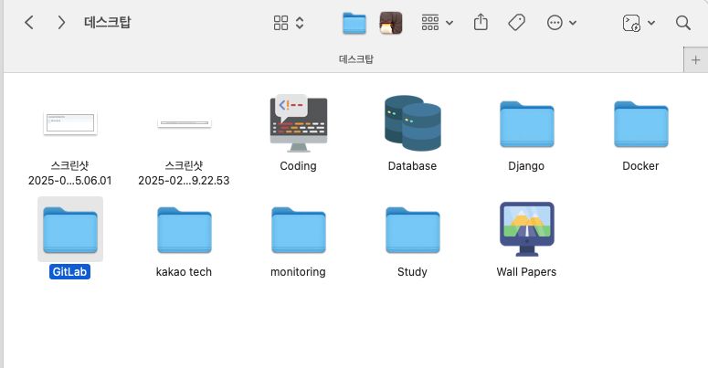
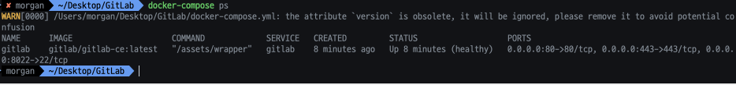
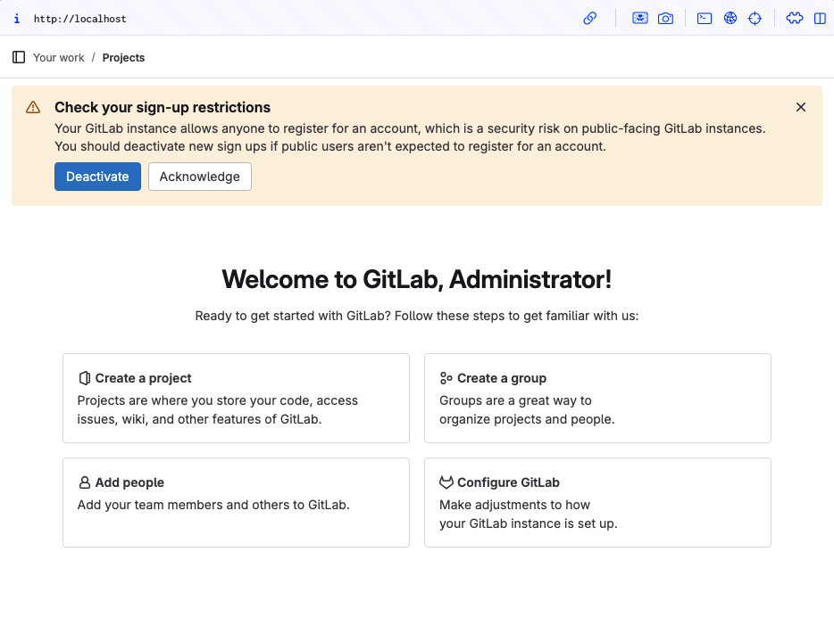
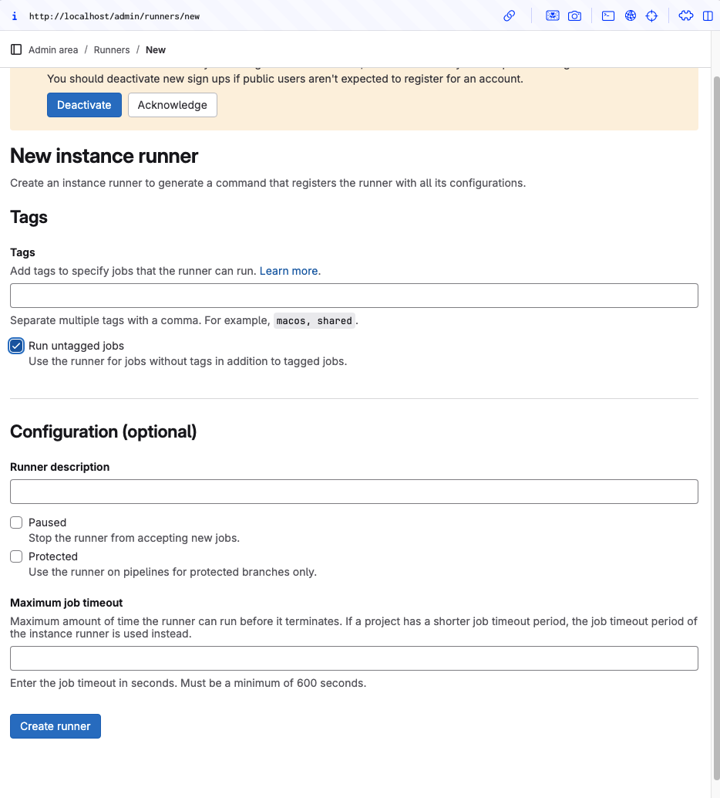
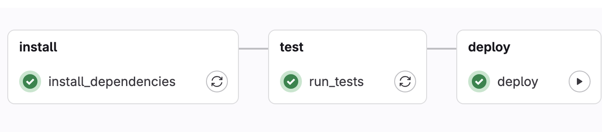
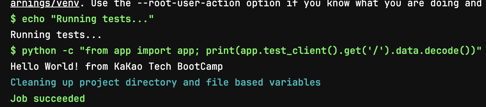
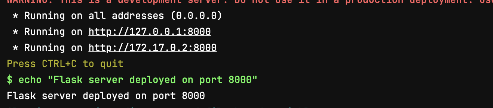

# GitLab을 이용하여 Docker 기반 CI/CD 파이프라인 만들기

# 설치 디렉토리

- 나는 내 컴퓨터에 설치할 것이기 때문에 폴더만 새로 만들었다
    
    
    

# Docker Compose 파일 생성

- `docker-compose.yml` 파일 작성
    
    ```bash
    version: "3.9"
    
    services:
      gitlab:
        image: 'gitlab/gitlab-ce:latest'
        container_name: gitlab
        restart: always
        hostname: 'gitlab.local'
        environment:
          GITLAB_OMNIBUS_CONFIG: |
            external_url 'http://localhost'
            gitlab_rails['gitlab_shell_ssh_port'] = 8022
          TZ: 'Asia/Seoul'
        ports:
          - "80:80"
          - "443:443"
          - "8022:22"
        volumes:
          - "./config:/etc/gitlab"
          - "./logs:/var/log/gitlab"
          - "./data:/var/opt/gitlab"
    ```
    
- `docker-compose up -d` 로 실행
    
    
    
    - STATUS가 healthy임을 볼 수 있다

# GitLab 접속

- `docker exec -it gitlab grep 'Password:' /etc/gitlab/initial_root_password` 로 초기 패스워드를 찾아서 이것을 기반으로 root로 로그인 할 수 있다
    
    
    

# GitLab Runner

- GitHub Actions와 동일한 역할
- GitLab CI/CD 파이프라인에서 실행되는 빌드 및 배포 작업을 처리하는 독립 실행 프로그램
- GitLab이 Job을 정의하면 받아서 실행하는 역할
- GitLab 설치와 똑같이 docker-compose.yml을 별도의 폴더에 만들어주고 실행하면 된다


## Runner 등록하기

- GitLab 페이지 - Admin Area - Runners에서 Runner 추가(`Run untagged jobs`)
    
    
    

```bash
gitlab-runner register  
--url http://172.20.5.229  
--token glrt-t1_3nn8wacNCYRJkbcPwr8E
```

- 위 절차를 차례대로 넣었고


- 드디어 성공했다ㅏㅏㅏㅏㅏㅏㅏㅏ

# 스크립트 작성

- 나는 간단히 루트 경로 진입 시, “Hello, World from KaKao BootCamp”라는 문구를 출력하는 Flask 기반 서버를 올려보고자 한다
- `.gitlab-ci.yml` 파일을 작성해야 GitLab에서 CI/CD를 실행 할 수 있다

```yaml
stages:
  - install
  - test
  - deploy

variables:
  # Flask 애플리케이션 실행에 필요한 환경변수 (필요한 경우)
  FLASK_APP: app.py

install_dependencies:
  stage: install
  image: python:3.9
  script:
    - echo "Installing dependencies..."
    - pip install --upgrade pip
    - pip install Flask
  artifacts:
    # 필요에 따라 캐시를 저장할 수 있습니다.
    paths:
      - .venv  # 예: 가상환경을 생성하는 경우
    expire_in: 1 hour

run_tests:
  stage: test
  image: python:3.9
  script:
    - pip install --upgrade pip
    - pip install Flask
    - echo "Running tests..."
    - python -c "from app import app; print(app.test_client().get('/').data.decode())"
  # 테스트 성공 시 200 OK 문자열이 포함되어야 정상
deploy:
  stage: deploy
  image: python:3.9
  script:
    - echo "Deploying Flask application..."
    - pip install --upgrade pip
    - pip install Flask
    - nohup python app.py &
    - sleep 5  # 서버가 올라올 시간을 잠시 대기
    - echo "Flask server deployed on port 8000"
  when: manual
```

- `gitlab-runner` 생성 시, **Docker**를 executor로 지정했기 때문에 단계 별로 서버 구동에 필요한 의존성 설치(python, Flask)가 필요하다 이것이 오버헤드를 늘릴 수 있기 때문에 executor를 **Shell**로 저장하여 한번만 설치하고, 테스트와 배포를 진행할 수도 있다

# 결과

- 배포 성공!!





