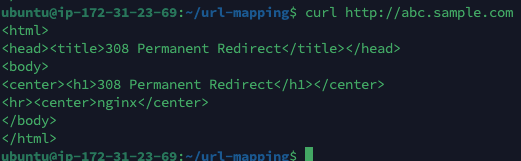

오늘은 쿠버네티스의 인그레스에 대해 집중적으로 공부해보았다.

# Ingress

- 서비스와 연결하여 애플리케이션을 공개하는 오브젝트
- 활성화 하기 - `minikube addons enable ingress`
    
    
    

## 애플리케이션 1,2,3

- `application1.yml`
    - 하나의 파드를 생성하여 “hello-world” 애플리케이션 실행하는 Deployment
    - 8080 포트에서 실행된 31445에서 hello-world로 접근 가능하게 하는 Service
    
    ```yaml
    apiVersion: apps/v1
    kind: Deployment
    metadata:
      name: helloworld-deployment
    spec:
      replicas: 1
      selector:
        matchLabels:
          app: hello-world
      template:
        metadata:
          labels:
            app: hello-world
        spec:
          containers:
            - image: "strm/helloworld-http"
              name: hello-world-container
              ports:
                - containerPort: 80
    ---
    apiVersion: v1
    kind: Service
    metadata:
      name: helloworld-svc
    spec:
      type: NodePort
      ports:
      - name: http
        port: 8080
        protocol: TCP
        targetPort: 80
        nodePort: 31445
      selector:
        app: hello-world
    ```
    
- `application2.yml`
    - 3개의 파드를 생성하여 Nginx 서버를 실행하는 Deployment
    - ClusterIP를 활용하여 9080 포트로 요청을 받아 80번 포트로 전달하는 Service
    
    ```yaml
    apiVersion: apps/v1
    kind: Deployment
    metadata:
      name: nginx-deployment
    spec:
      replicas: 3
      selector:
        matchLabels:
          app: nginx
      template:
        metadata:
          labels:
            app: nginx
        spec:
          containers:
            - image: nginx
              name:  nginx
              ports:
                - containerPort: 80
    ---
    apiVersion: v1
    kind: Service
    metadata:
      name: nginx-svc
    spec:
      selector:
        app: nginx
      ports:
          - name: http
            port: 9080
            targetPort: 80
    ```
    
- `application3.yml`
    - Open Liberty 애플리케이션 서버를 실행하는 파드를 생성 - Deployment와 요청을 전달하는 ClusterIP서비스
    
    ```yaml
    apiVersion: apps/v1
    kind: Deployment
    metadata:
      name: java-deployment
    spec:
      replicas: 1
      selector:
        matchLabels:
          app: liberty
      template:
        metadata:
          labels:
            app: liberty
        spec:
          containers:
            - image: openliberty/open-liberty:javaee8-ubi-min-amd64
              name:  open-liberty
              ports:
                - containerPort: 9080
                  name: httpport
    ---
    apiVersion: v1
    kind: Service
    metadata:
      name: java-svc
    spec:
      selector:
        app: liberty
      ports:
          - name: http
            port: 9080
            targetPort: 9080
    ```
    

## 인그레스 yml

- NGINX Ingress Controller를 사용하여(`ingressClassName: "nginx"`), 도메인 별로 들어오는 HTTP 요청을 서로 다른 Service로 라우팅
- Ingress의 이름은 `hello-ingress`이며, `nginx.ingress.kubernetes.io/rewrite-target: /` 어노테이션에 따라, 요청 경로가 백엔드로 전달되기 전에 `/`로 재작성된다
- **첫 번째 규칙 (host: abc.sample.com):**
    - 경로 `/`에 대한 요청은 `helloworld-svc` 서비스의 포트 이름 "http"로 전달
    - 경로 `/apl2`에 대한 요청은 `nginx-svc` 서비스의 포트 이름 "http"로 전달
    - 이때, 두 경로 모두 `pathType: Prefix`로 설정되어, 접두사 매칭 방식으로 처리
- **두 번째 규칙 (host: xyz.sample.com):**
    - 경로 `/`에 대한 요청은 `java-svc` 서비스의 포트 이름 "http"로 전달

```yaml
apiVersion: networking.k8s.io/v1
kind: Ingress
metadata:
  name: hello-ingress
  annotations:
    nginx.ingress.kubernetes.io/rewrite-target: /
spec:
  ingressClassName: "nginx"
  rules:
  - host: abc.sample.com
    http:
      paths:
      - path: /
        pathType: Prefix
        backend:
          service:
            name: helloworld-svc
            port:
              name: http
      - path: /apl2
        pathType: Prefix
        backend:
          service:
            name: nginx-svc
            port:
              name: http
  - host: xyz.sample.com
    http:
      paths:
      - path: /
        pathType: Prefix
        backend:
          service:
            name: java-svc
            port:
              name: http
```


- 3가지 요청에 따라 각각 `hello-world`, `nginx`, `Open Liberty`가 실행된 모습

## TLS 암호화를 포함한 인그레스 Manifest

- 인증서 발급
    
    ```bash
    sudo openssl req -x509 -nodes -days 365 -newkey rsa:2048 -keyout nginx-selfsign
    ed.key -out nginx-selfsigned.crt
    ```
    
- 클러스터 내에서 민감한 데이터를 저장하기 위한 Secret 객체를 생성
    
    ```bash
    kubectl create secret tls tls-certificate --key nginx-selfsigned.key --cert nginx-selfsigned.crt
    ```
    
- TLS가 포함된 Mainifest - 강제 ssl 리다이렉션이 추가됨
    
    ```bash
    apiVersion: networking.k8s.io/v1
    kind: Ingress
    metadata:
      name: hello-ingress
      annotations:
        nginx.ingress.kubernetes.io/rewrite-target: /
        nginx.ingress.kubernetes.io/force-ssl-redirect: 'true'
    
    spec:
      ingressClassName: "nginx"
      tls:
      - hosts:
        - abc.sample.com
        secretName: tls-certificate
      rules:
      - host: abc.sample.com
        http:
          paths:
          - path: /
            pathType: Prefix
            backend:
              service:
                name: helloworld-svc
                port:
                  name: http
          - path: /apl2
            pathType: Prefix
            backend:
              service:
                name: nginx-svc
                port:
                  name: http
      - host: xyz.sample.com
        http:
          paths:
          - path: /
            pathType: Prefix
            backend:
              service:
                name: java-svc
                port:
                  name: http
    ```
    



- http로 접근 시, `HttpCode 308 - Permanent Redirect` 반환


- HTTPS 접근
    - **Self-signed certificate 에러:**
        
        기본적으로 curl은 서버의 인증서가 신뢰할 수 있는 인증기관(CA)에 의해 서명되었는지 확인하는데, 자체 서명된 인증서(self-signed certificate)는 이러한 신뢰 체계에 포함되지 않기 때문에, 검증 실패로 에러(코드 60)를 발생
        
    - `--insecure` 옵션:
        
        이 옵션을 사용하면 curl이 SSL 인증서 검증을 건너뛰므로, 에러 없이 HTTPS 연결이 가능
        

## 세션 어피니티

- 세션 정보를 기록하는 php 서버를 도커 이미지로 만들어 실행할 것이다
    - 현재의 호스트 이름을 출력
    - 세션 카운트를 하여 몇번째 접근인지 표시
    
    ```php
    <?php
    session_start();
    if (!isset($_SESSION['count'])) {
        $_SESSION['count'] = 1;
    } else {
        $_SESSION['count']++;
    }
    echo "Hostname: ".gethostname()."<br>\n";
    echo $_SESSION['count']."th time access.\n";
    ?>
    ```
    
- 인그레스 Manifest
    - PHP가 자체적으로 생성하는 쿠키인 `PHPSESSID`를 기반으로 세션 어피니티를 설정
    `~/session-cookie-name: “PHPSESSID”`
    
    ```yaml
    apiVersion: networking.k8s.io/v1
    kind: Ingress
    metadata:
      name: hello-ingress
      annotations:
        nginx.ingress.kubernetes.io/affinity: "cookie"
        nginx.ingress.kubernetes.io/session-cookie-name: "PHPSESSID"
    spec:
      ingressClassName: "nginx"
      rules:
      - host: abc.sample.com
        http:
          paths:
          - path: /
            pathType: Prefix
            backend:
              service:
                name: session-svc
                port:
                  number: 9080                              
    ```
    
- `curl` 동작 중 `-c` 옵션으로 쿠키를 생성한 뒤, `-b` 옵션으로 생성된 쿠키를 재사용해보았다

