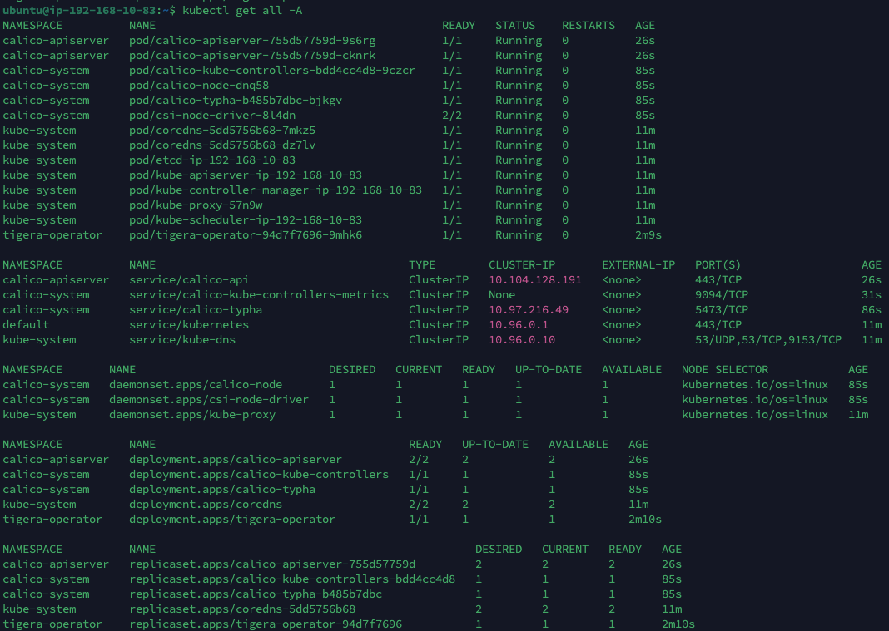
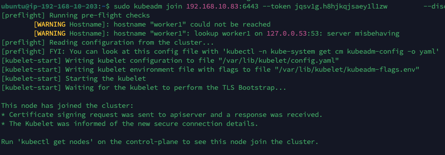
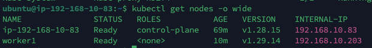

## 시나리오 기반 쿠버네티스 환경 구축하기

- 단계 별로 구분하여 진행

### 1단계: 쿠버네티스 클러스터 구축 및 애플리케이션 배포

- EC2 인스턴스 2개를 활용한 멀티노드로 구축해보았다(동일 VPC)
    - 마스터노드(`EC2-kube-master-AZone`) 조건
        - Ubuntu 22.04 LTS
        - t3.medium(vCPU 2개, RAM 4GB)
        - 탄력적 IP 연결
        - ArgoCD
    - 워커노드(`EC2-kube-worker1-AZone`) 조건
        - Ubuntu 22.04 LTS
        - t3.medium(vCPU 2개, RAM 4GB)
- 공통 설치
    
    ```bash
    # 방화벽 해제(포트 개방)
    sudo ufw disable
    
    # timezone 설정
    sudo timedatectl set-timezone "Asia/Seoul"
    sudo timedatectl set-ntp true
    sudo systemctl restart systemd-timesyncd.service
    
    # iptable 세팅
    cat <<EOF | sudo tee /etc/modules-load.d/k8s.conf
    overlay
    br_netfilter
    EOF
    
    sudo modprobe overlay
    sudo modprobe br_netfilter
    
    # 필요한 sysctl 파라미터를 설정하면, 재부팅 후에도 값이 유지된다.
    cat <<EOF | sudo tee /etc/sysctl.d/k8s.conf
    net.bridge.bridge-nf-call-iptables  = 1
    net.bridge.bridge-nf-call-ip6tables = 1
    net.ipv4.ip_forward                 = 1
    EOF
    
    # 재부팅하지 않고 sysctl 파라미터 적용하기
    sudo sysctl --system
    
    # 스왑 비활성화
    sudo swapoff -a
    ```
    
    ```bash
    # 업데이트 및 필수 패키지 설치
    sudo apt-get update && sudo apt-get install -y apt-transport-https ca-certificates curl gnupg lsb-release
    
    # containerd 설치
    sudo apt-get install containerd
    
    # contianerd 등록
    sudo systemctl enable containerd
    
    # containerd 설정
    sudo mkdir /etc/containerd
    
    # 기본 config 설정 파일 생성
    sudo containerd config default | sudo tee /etc/containerd/config.toml
    
    # cgroup 드라이버 설정
    sudo vi /etc/containerd/config.toml 
    -> 'SystemdCgroup' = true로 변경(대소문자 정확히 해야함)
    
    sudo apt-get update
    
    # Kubernetes pacakage repository의 public signing key 다운로드
    curl -fsSL https://pkgs.k8s.io/core:/stable:/v1.29/deb/Release.key | sudo gpg --dearmor -o /etc/apt/keyrings/kubernetes-apt-keyring.gpg
    
    # 쿠버네티스 apt 리포지터리 추가
    echo "deb [signed-by=/etc/apt/keyrings/kubernetes-apt-keyring.gpg] https://pkgs.k8s.io/core:/stable:/v1.29/deb/ /" | sudo tee /etc/apt/sources.list.d/kubernetes.list
    
    # kubeadm, kubelet, kubectl 설치
    sudo apt-get update
    sudo apt-get install -y kubelet kubeadm kubectl
    sudo apt-mark hold kubelet kubeadm kubectl
    
    # crictl로 node, container 등 debugging 하기 위해 환경변수 setting
    sudo crictl config --set runtime-endpoint=unix:///var/run/containerd/containerd.sock 
    
    sudo systemctl restart containerd
    
    # 쿠버네티스 apt 리포지터리 추가
    echo "deb [signed-by=/etc/apt/keyrings/kubernetes-apt-keyring.gpg] https://pkgs.k8s.io/core:/stable:/v1.29/deb/ /" | sudo tee /etc/apt/sources.list.d/kubernetes.list
    
    ```
    
- **마스터 노드**
    - kubeadm을 이용하여 한 클러스터로 연결하기
        
        ```bash
        # Pod 네트워크와 호환되도록 CIDR을 지정
        sudo kubeadm init --pod-network-cidr=192.168.0.0/16 --apiserver-advertise-address <master-node ip address>
        
        mkdir -p $HOME/.kube
        sudo cp /etc/kubernetes/admin.conf $HOME/.kube/config
        sudo chown $(id -u):$(id -g) $HOME/.kube/config
        
        export KUBECONFIG=$HOME/.kube/config
        
        ```
        
    - Calico 설치
        
        ```bash
        # tigera operator 설치
        kubectl create -f https://raw.githubusercontent.com/projectcalico/calico/v3.26.1/manifests/tigera-operator.yaml
        
        # 추가 커스텀 설치
        kubectl create -f https://raw.githubusercontent.com/projectcalico/calico/v3.26.1/manifests/custom-resources.yaml
        ```
        
    - 현재까지의 진행이 잘 되었는지 `kubectl get all -A`로 확인
        
        
        
    - 노드 확인
        
        ```bash
        kubectl get nodes -o wide
        ```
        
        
        
- 워커 노드
    - 공통 설치 이후에 join을 하면 된다
    
    ```bash
    kubeadm join <마스터 노드 IP>:6443 --token <토큰> \
            --discovery-token-ca-cert-hash 
    ```
    
    - 마스터 노드에서 `kubeadm init` 했을 때 생긴 토큰과 인증서를 기입하면 된다
    
    
    
- 마스터 노드에서 `kubectl get nodes`
    